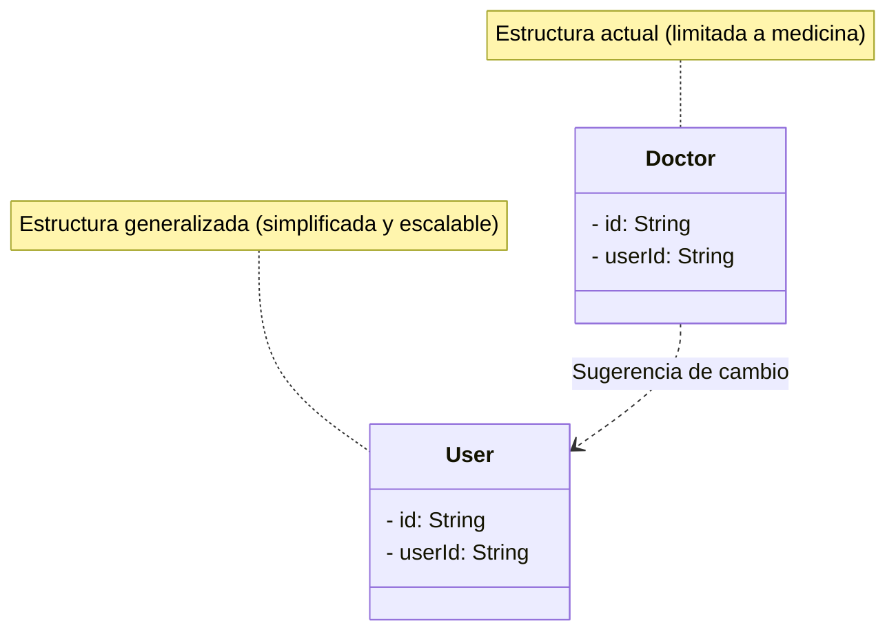

# 🛠️ Mejoras, Errores y Simplificación del Proyecto (Improvements & Simplifications)

Este documento detalla los posibles errores (bugs/seguridad) detectados en el análisis del proyecto, propuestas de optimización de rendimiento y estrategias clave para simplificar el código de cara a futuras ampliaciones.

---

## 🔒 1. Seguridad y Robustez (Alta Prioridad)

### ⚠️ Ausencia de Rate Limiting (Abuso y DDoS)
*   **Problema**: El endpoint público de envíos `/api/public/submissions/[token]` no tiene límite de peticiones. Un atacante podría inundar la base de datos con miles de envíos falsos en minutos. Lo mismo aplica para la API de chat `/api/chat` que consume créditos de Groq.
*   **Solución**: Implementar una capa de Rate Limiting usando servicios como `@upstash/ratelimit` (Redis) en los endpoints críticos para limitar las peticiones por dirección IP o por sesión de usuario.

### ⚠️ Falta de Control de Errores (`try/catch`) en Server Actions
*   **Problema**: Ciertas Server Actions como `actions/forms/crud.ts` o `actions/forms/access.ts` realizan operaciones sobre Prisma sin envolverlas en bloques `try/catch`. Si la base de datos se desconecta o hay un error de unicidad, el sistema lanzará un `Unhandled Promise Rejection` bloqueando la UI del usuario en un estado de carga infinito o error 500 crudo.
*   **Solución**: Envolver las consultas en bloques `try/catch` y retornar un objeto estandarizado con el estado de la operación:
    ```typescript
    try {
      // lógica...
      return { success: true, data: result };
    } catch (error) {
      console.error(error);
      return { success: false, error: "Mensaje amigable para el usuario" };
    }
    ```

### ⚠️ Falta de Validación de Payloads en el Backend
*   **Problema**: Se confía en la estructura enviada desde el cliente al guardar los campos (`fields`) de un formulario o al enviar respuestas (`responses`). Un atacante podría interceptar las peticiones HTTP e inyectar scripts maliciosos (XSS) o datos corruptos que no cumplan con el esquema esperado.
*   **Solución**: Utilizar **Zod** en el servidor para validar rigurosamente la estructura del JSON recibido antes de guardarlo en la base de datos PostgreSQL.

---

## ⚡ 2. Rendimiento y Optimización (Performance)

### 🚀 Consultas Secuenciales (N+1) en el Dashboard
*   **Problema**: La carga de la página del dashboard realiza 5 llamadas secuenciales y bloqueantes a la base de datos usando Prisma (`totalForms`, `totalSubmissions`, etc.), lo que duplica el tiempo de respuesta.
*   **Solución**: Utilizar `Promise.all()` para ejecutar las consultas en paralelo o agruparlas mediante `groupBy` de Prisma.

### 🚀 Carga de Submissions sin Paginación
*   **Problema**: Al ver los detalles de un formulario, se cargan todas las respuestas de golpe. Con el paso del tiempo, esto ralentizará la página drásticamente y podría causar fallos de timeout de memoria.
*   **Solución**: Introducir paginación (ej: `take: 20`, `skip: X`) en la Server Action que recupera respuestas y agregar botones de "Siguiente/Anterior" o scroll infinito en el frontend.

### 🚀 Riesgo de Hidratación (Hydration Mismatch) en el Client Side
*   **Problema**: Componentes como `FormBuilder` intentan leer variables globales del navegador como `window.scrollY` o añadir listeners antes de que el componente esté montado por completo.
*   **Solución**: Asegurarse de que el uso de variables del objeto `window` esté contenido exclusivamente dentro de hooks `useEffect` o tras validar que un estado `isMounted` sea `true`.

---

## 🎨 3. Calidad de Código y Limpieza (Code Quality)

### 🧹 Uso de `any` y Aserciones de Tipo `as unknown as ...`
*   **Problema**: En la API de chat y páginas dinámicas se utiliza `any` o aserciones de tipo para ignorar los errores de TypeScript. Esto debilita la seguridad de tipado estricto y puede camuflar errores de compatibilidad que aparecerán en producción.
*   **Solución**: Reemplazar todos los `any` por tipos estructurados o genéricos utilizando las interfaces ya creadas en `types/form.types.ts` y `types/submission.types.ts`.

### 🧹 Elementos y Helpers de Desarrollo en Producción
*   **Problema**: El componente `screensizehelper.tsx` (que muestra el tamaño actual de la pantalla para maquetación) y múltiples sentencias `console.log` están activos en producción.
*   **Solución**: Condicionar el renderizado de helpers de desarrollo al entorno actual (`process.env.NODE_ENV === 'development'`) y eliminar o silenciar logs innecesarios.

---

## 🗺️ 4. Simplificación y Generalización del Proyecto (Simplification & Generalization)

Actualmente, el proyecto está conceptualmente acotado al nicho médico (`Doctor`, `Patient`). Una excelente forma de simplificar el proyecto y aumentar su potencial comercial es **generalizar su dominio**.

### 🔄 Generalización de Modelos de Base de Datos
*   **De "Médico/Doctor" a "Creador/Usuario"**: Renombrar el modelo `Doctor` a `User` (o `Creator`). Esto permite que cualquier persona o empresa cree formularios.
*   **De "Paciente/Patient" a "Participante/Submission"**: El modelo `FormSubmission` (que actualmente usa términos de paciente en algunas partes de los tipos) ya está bien encaminado. Es recomendable eliminar todo rastro del modelo `Patient` (anterior) y renombrar las relaciones asociadas a `Respondent` (Respondedor) o `Participant`.



### 🔄 Simplificación de la Arquitectura
*   **Consolidar Endpoints**: Las rutas de API que solo realizan lecturas o escrituras sencillas pueden reemplazarse completamente por **Server Actions**, reduciendo la cantidad de código repetitivo de APIs en la carpeta `/app/api`.
*   **Estandarizar Notificaciones de Error**: Implementar un manejador global de toasts mediante `Sonner` para que cada llamada al servidor que falle muestre un mensaje de feedback coherente en lugar de fallar en silencio.
