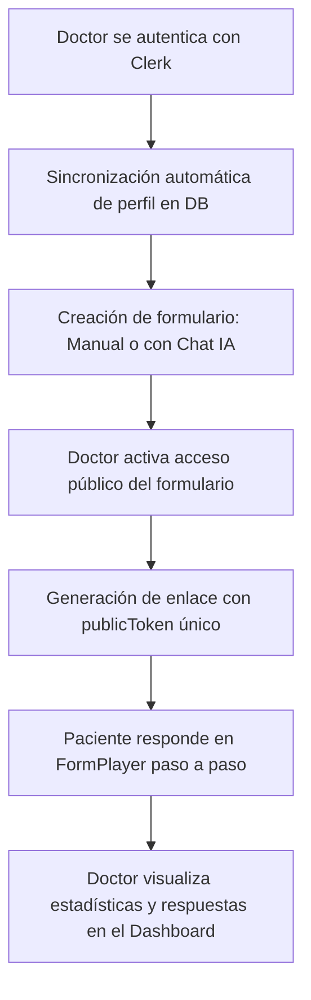

# 👁️ Resumen del Proyecto (Overview)

**Form Creator** (o NexJS Form Creator) es una plataforma web premium y moderna diseñada específicamente para **profesionales de la salud** (médicos, doctores y especialistas) que simplifica el diseño, gestión y completado de historias clínicas, evaluaciones y cuestionarios dinámicos. 

El proyecto combina un potente creador de formularios visuales con un asistente interactivo impulsado por Inteligencia Artificial (IA) y un motor de visualización paso a paso para los pacientes con una experiencia tipo "Typeform".

---

## 👥 Audiencia y Propósito

*   **Doctores / Profesionales de la Salud**: Cuentan con un panel privado (Dashboard) donde pueden gestionar sus formularios, usar un asistente de IA para crear plantillas en segundos, compartirlas a través de enlaces seguros, y analizar respuestas junto con estadísticas en tiempo real.
*   **Pacientes**: Completan los formularios en una interfaz limpia, optimizada para móviles, sin necesidad de iniciar sesión, respondiendo una pregunta a la vez con transiciones fluidas.

---

## ⚙️ Flujo Principal de Trabajo (Core Flow)

1.  **Acceso Seguro**: Autenticación del médico mediante Clerk (Google, Correo Electrónico).
2.  **Sincronización (Sync)**: Sincronización transparente del usuario de Clerk con la base de datos PostgreSQL (`Doctor`).
3.  **Diseño Inteligente**: El médico puede diseñar el formulario en el constructor visual (`FormBuilder`) o pedirle al asistente de IA (`Chat`) que lo genere interpretando lenguaje natural.
4.  **Publicación**: Se activa el acceso público del formulario, generando un `publicToken` seguro.
5.  **Completado Paso a Paso**: El paciente responde el formulario en un visualizador interactivo (`FormPlayer`) optimizado para dispositivos móviles.
6.  **Análisis y Estadísticas**: Las respuestas se registran como `FormSubmission` y se notifican y visualizan en el panel de control del doctor en tiempo real.

---

## 🛠️ Stack Tecnológico

El proyecto está construido bajo una arquitectura moderna con componentes de alto rendimiento y cero-tiempo-de-ejecución en estilos:

| Tecnología | Versión | Propósito / Rol |
| :--- | :--- | :--- |
| **Next.js** | `16.1.6` | App Router, Server Actions y React Server Components (RSC) |
| **React** | `19.2.3` | Biblioteca de UI con renderizado interactivo |
| **Tailwind CSS** | `v4.0.0` | Motor de estilos de alto rendimiento (Zero-runtime compile) |
| **Prisma Client** | `7.3.0` | ORM para interactuar con la base de datos PostgreSQL |
| **Clerk NextJS** | `^6.37.3` | Gestión de identidad y seguridad de usuarios (Doctores) |
| **Groq SDK** | `^1.1.2` | Cliente IA para interactuar con `llama-3.3-70b-versatile` |
| **Radix UI** | `^1.4.3` | Primitivas UI y accesibilidad (menús, diálogos, selectores) |
| **Framer Motion** | `^12.38.0` | Animaciones y micro-interacciones interactivas en frontend |
| **Sonner** | `^2.0.7` | Componente de notificaciones toast flotantes |

---

## 🗂️ Estructura del Repositorio

El proyecto utiliza la estructura de carpetas oficial de Next.js (App Router):

*   `/actions`: Server Actions modulares agrupados por dominio (`forms`, `doctors`).
*   `/app`: Rutas del sistema.
    *   `/(dashboard)`: Rutas privadas protegidas por middleware (Navbar, Sidebar, Dashboard, Editor, Chat).
    *   `/(public)`: Rutas públicas libres de navegación interna para pacientes (`/form/[token]`).
    *   `/api`: Endpoints de la API backend (endpoints públicos y chat IA).
*   `/components`: Componentes UI reutilizables y secciones del sitio.
    *   `/FormBuilder`: Lógica y UI del constructor de formularios.
    *   `/FormPlayer`: Motor de visualización animado paso a paso para el paciente.
    *   `/Chat`: Chat con IA conversacional y menús de herramientas.
    *   `/ui`: Componentes base reutilizables estilizados con Tailwind.
*   `/lib`: Clientes persistentes (`prisma.ts`), validadores y utilidades.
*   `/prisma`: Definición de esquema y migraciones de la base de datos.
*   `/types`: Definiciones de interfaces TypeScript del negocio.
