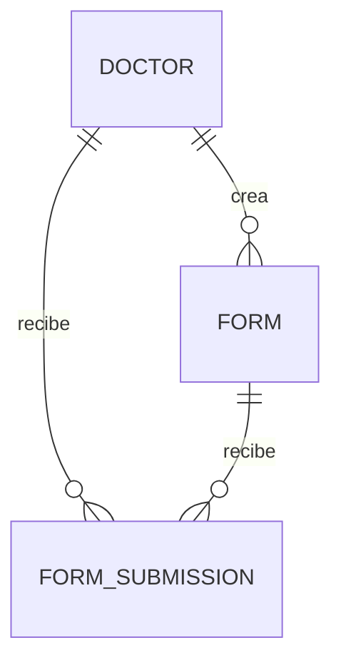

# 🗄️ Esquema de Base de Datos y Tipos (Schema & Types)

Este documento detalla la estructura de datos del proyecto, incluyendo los modelos de **Prisma ORM** (conectados a una base de datos PostgreSQL) y las definiciones de interfaces en **TypeScript** utilizadas en el flujo de la aplicación.

---

## 💾 Modelado de Datos (Prisma)

El esquema utiliza relaciones referenciales para asegurar la integridad de los datos en cascada y almacena configuraciones y respuestas en formato **JSON** para una máxima flexibilidad sin necesidad de alterar la base de datos con cada cambio de campo.



### 1. Enumeraciones (Enums)

#### `SubmissionStatus`
Define el ciclo de vida del estado de respuesta de un paciente al formulario:
*   `pending`: El paciente inició el formulario pero no lo ha enviado aún.
*   `completed`: Formulario enviado exitosamente.
*   `expired`: Sesión expirada (timeout automático de 30 minutos).
*   `cancelled`: Cancelado de forma explícita.

```prisma
enum SubmissionStatus {
  pending
  completed
  expired
  cancelled
}
```

---

### 2. Modelos (Models)

#### `Doctor`
Representa al usuario profesional de la salud autenticado mediante Clerk.

```prisma
model Doctor {
  id        String   @id @default(cuid())
  userId    String   @unique // Clerk User ID para vinculación
  email     String
  firstName String
  lastName  String
  createdAt DateTime @default(now())

  forms       Form[]
  submissions FormSubmission[]
}
```

#### `Form`
Representa una plantilla de formulario diseñada por el médico.

*   `fields` (`Json`): Estructura de preguntas dinámica (Ver sección de tipos para el formato interno).
*   `publicToken`: Token único autogenerado al habilitar el formulario de forma pública.
*   `isPublicOpen`: Switch maestro para desactivar o activar el acceso público al formulario.

```prisma
model Form {
  id          String   @id @default(cuid())
  doctorId    String
  name        String
  description String?
  fields      Json     // Estructura dinámica (FormField[])
  isActive    Boolean  @default(true)
  version     Int      @default(1)

  publicToken  String? @unique
  isPublicOpen Boolean @default(false)

  createdAt DateTime @default(now())
  updatedAt DateTime @updatedAt

  doctor      Doctor           @relation(fields: [doctorId], references: [id], onDelete: Cascade)
  submissions FormSubmission[]

  @@index([doctorId])
  @@index([isActive])
}
```

#### `FormSubmission`
Representa una respuesta específica enviada por un paciente.

*   `token`: String único en la URL que le permite al paciente completar el formulario de forma segura y sin login.
*   `responses` (`Json`): Respuestas ingresadas por el paciente (clave-valor de `[fieldId]: value`).

```prisma
model FormSubmission {
  id          String           @id @default(cuid())
  token       String           @unique
  doctorId    String
  formId      String
  responses   Json?            // Respuestas del formulario (FormResponse)
  status      SubmissionStatus @default(pending)
  createdAt   DateTime         @default(now())
  completedAt DateTime?

  doctor Doctor @relation(fields: [doctorId], references: [id], onDelete: Cascade)
  form   Form   @relation(fields: [formId], references: [id], onDelete: Cascade)

  @@index([doctorId])
  @@index([formId])
  @@index([status])
}
```

---

## 🏷️ Tipos de TypeScript (Types)

### 1. Estructura de Campos (`form.types.ts`)

Los formularios son dinámicos y sus preguntas se configuran bajo la interfaz `FormField`.

```typescript
export type FieldType = InteractiveFieldType | 'section';

export type InteractiveFieldType =
  | 'text'
  | 'number'
  | 'textarea'
  | 'select'
  | 'radio'
  | 'checkbox';

export type ConditionalOperator =
  | 'equals'      // Igual a un valor
  | 'includes'    // Incluye un valor (para checkbox)
  | 'notEmpty';   // Tiene algún valor

export interface FormField {
  id: string;
  type: FieldType;
  label: string;
  placeholder?: string;
  options?: string[];           // Para select, radio, checkbox
  allowOther?: boolean;         // Permite la opción "Otro: ___"
  required?: boolean;
  showIf?: {                    // Lógica condicional
    fieldId: string;
    operator: ConditionalOperator;
    value: string | string[];
  };
}
```

### 2. Estructura del Formulario (`form.types.ts`)

```typescript
export interface Form {
  id: string;
  doctorId: string;
  name: string;
  description?: string;
  fields: FormField[];
  isActive: boolean;
  createdAt: Date;
  updatedAt: Date;
  publicToken: string | null;
  isPublicOpen: boolean;
}
```

### 3. Respuestas y Envíos (`submission.types.ts`)

Las respuestas se guardan en un objeto asociativo (`FormResponse`) mapeando el ID del campo a su valor.

```typescript
export type SubmissionStatus = "pending" | "completed" | "expired" | "cancelled";

export interface FormResponse {
  [fieldId: string]: FieldValue;
}

export type FieldValue =
  | string
  | number
  | boolean
  | string[]
  | null
  | undefined;

export interface Submission {
  id: string;
  formId: string;
  responses: FormResponse;
  status: SubmissionStatus;
  createdAt: Date;
  completedAt?: Date | null;
}
```

### 4. Perfiles del Sistema (`doctor.types.ts`)

```typescript
export interface Doctor {
  id: string;
  userId: string;
  email: string;
  firstName: string;
  lastName: string;
  createdAt: Date;
}

// Representación de sesión activa para completar formularios (antigua compatibilidad)
export interface Patient {
  id: string;
  token: string;
  doctorId: string;
  formId: string;
  firstName?: string;
  lastName?: string;
  formResponses?: FormResponse;
  formCompleted: boolean;
  completedAt?: Date;
  createdAt: Date;
  linkSentAt: Date;
}
```
